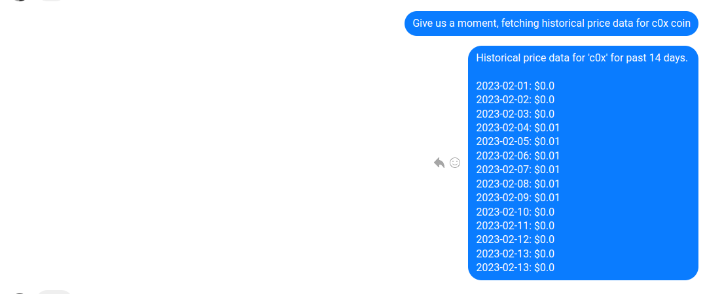

# Valleybot

To start your Phoenix server:

- Install dependencies with `make setup`
- Start Phoenix endpoint with `make run` or inside IEx with `iex -S mix phx.server`
- To build the docker image, run it, or any other command, check the `Makefile` for available commands.

Now you can visit [`localhost:4000`](http://localhost:4000) from your browser.
